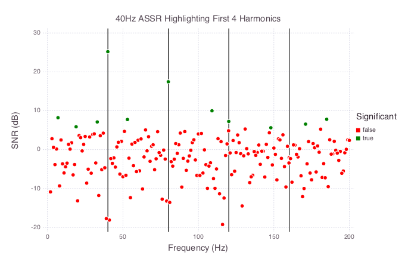

# EEG

[](https://travis-ci.org/codles/EEG.jl)
[](https://ci.appveyor.com/project/codles/eeg-jl/branch/master)
[](https://coveralls.io/r/codles/EEG.jl?branch=master)
[](https://github.com/igrigorik/ga-beacon)
[](https://eegjl.readthedocs.org/en/latest/)


Process EEG files in Julia.

*If you use this software let me know, and I will stop making breaking changes.*

(**For research only. Not for clinical use. Use at your own risk**)

## Installation

To install this package, run the following command into Julia's command line:


```julia
Pkg.clone("git://github.com/codles/EEG.jl.git")
```

## Documentation

See [documentation](http://codles.github.io/EEG.jl/).  


## Example

```julia

using EEG, DataFrames, Gadfly


# Read file and pre processing
a = read_SSR("Example-40Hz.bdf")
a = highpass_filter(a)
a = rereference(a, "Cz")
a = merge_channels(a, EEG_Vanvooren_2014, "Merged")
    remove_channel!(a, EEG_64_10_20)


# Run an F-test and save data
a = extract_epochs(a)
a = create_sweeps(a)
a = ftest(a, modulationrate(a)*[1, 2, 3, 4]) # Look at harmonics
a = ftest(a, [2:200])                        # Look at off stimulation frequencies
a = save_results(a)


# Read the saved data and plot with Gadfly.jl
df = readtable("Example-40Hz.csv")
df[:Significant] = df[:Statistic] .< 0.05

p = plot(df, x="AnalysisFrequency", y="SNRdB", color="Significant",
             xintercept=float(a.modulation_frequency)*[1, 2, 3, 4],
             Geom.vline(color="black"), Geom.point,
             Guide.title("40Hz SSR Highlighting First 4 Harmonics"),
             Guide.xlabel("Frequency (Hz)"), Guide.ylabel("SNR (dB)"),
             Scale.discrete_color_manual("red","green"))

draw(PNG("Example-40Hz.png", 18cm, 12cm), p)
```


Results in the following figure which displays the SNR at each frequency.
The vertical lines highlight the harmonics of the stimulus and color represents if a significant response was detected.




## Plot single and multi channel data

```julia
using EEG, Gadfly

# Pre process data
s = read_SSR("file.bdf")
s = highpass_filter(s)
s = rereference(s, "Cz")
    keep_channel!(s, EEG_Vanvooren_2014)        # Reduce number of channels
s = trim_channel(s, 8192*80, start = 8192*50)   # Reduce length of signal to plot

# Plot multi channel time series
f = plot_timeseries(s)
    draw(PNG("multichannel-timeseries.png", 8inch, 6inch), f)

# Plot single channel time series
f = plot_timeseries(s, channels="P6")
    draw(PNG("singlechannel-timeseries.png", 8inch, 3inch), f)
```


